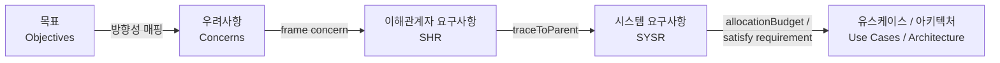

# 🚗 EGAS (Electronic Throttle Control) System — SysML v2 Model

본 프로젝트는 현대 자동차 환경에서 다수의 복합적인 토크 요구를 안전하게 중재하고, 극한의 주행 상황에서도 차량의 추진력을 완벽하게 통제하기 위한 지능형 엔진 제어 시스템(**EGAS**, Electronic Throttle Control)을 모델링한 **MBSE(Model-Based Systems Engineering)** 프로젝트입니다.

---

## 📘 방법론 (Methodology)

본 모델은 **SPES 2020 (Software Platform Embedded Systems)** 프레임워크와 **SYSMOD** 방법론을 기반으로 작성되었습니다.

| 구분 | 설명 |
|---|---|
| **SPES 2020 Framework** | 복잡한 임베디드 시스템 설계를 위해 시스템을 4가지 Viewpoint(Requirements, Functional, Logical, Technical)와 여러 Abstraction Layer로 나누어 분석합니다. 본 저장소의 현재 버전은 EGAS 시스템의 **Requirements Viewpoint**를 중심으로 시스템의 컨텍스트, 이해관계자 니즈, 유스케이스, 시스템 요구사항을 정의합니다. |
| **SYSMOD & SysML v2** | SYSMOD의 요구사항 메타데이터(Priority, Criticality, Risk, V&V Method 등) 프로파일을 적용하였으며, 텍스트 기반 명세의 한계를 넘어 SysML v2의 텍스트/그래픽 표기법을 통해 요구사항 간 추적성(Traceability)과 검증(Verification) 논리를 수학적 제약(Constraints)으로 정량화했습니다. |

---

## 🎯 핵심 기능 및 시스템 역량 (Key Features & System Capabilities)

EGAS 시스템 모델은 다음의 핵심 주행 및 안전 시나리오를 포괄합니다.

| 기능 | 설명 | 타이밍 / 기준 |
|---|---|---|
| **안전 최우선 토크 중재** (Torque Arbitration) | 가속 페달, 크루즈 컨트롤, 외부 제어기(ESP/TCU)의 상충되는 토크 요구를 수집하고 중재합니다. | — |
| **브레이크 오버라이드** (Brake Override) | 가속과 제동이 동시에 입력될 경우, 제동을 최우선으로 판단하여 토크를 강제 차단합니다. | **10ms 이내**, 토크 0.0 차단 |
| **긴급 토크 개입** (Emergency Intervention) | 빙판길 미끄럼 방지 등을 위한 외부 제어기의 토크 저감 요청 시 공기량 및 연료 분사량을 조절합니다. | **15ms 이내** |
| **페일세이프 및 이중화 진단** (Fail-Safe & Diagnostics) | 가속 페달(PVS) 및 스로틀 밸브(TPS) 센서의 이중화 편차 감지, 엔진 오버히팅 및 액추에이터 고착(Stuck) 감지 시 즉각적인 연료 차단을 수행합니다. | 편차 **5.0% 초과** 시 |
| **유지보수 및 캘리브레이션** (Maintenance & Calibration) | 메모리 인가 및 무결성 검증, 신속한 파라미터 업데이트 및 영점 조정 자동화(Zero-Point Calibration) 프로세스를 지원합니다. | **100ms 이내** |

---

## 🗂️ 프로젝트 구조 (SysML v2 Packages)

프로젝트는 SPES 모델링 프레임워크의 아티팩트 구조에 따라 아래와 같이 패키지로 모듈화되어 있습니다.

| 패키지 | 설명 |
|---|---|
| `RV_Objectives` | 프로젝트의 근본적인 문제 정의(Problem Statement)와 시스템 아이디어를 정의합니다. |
| `RV_StakeHolderModel` | 운전자, 규제 기관, 플랫폼 엔지니어 등 핵심 이해관계자와 그들의 우려사항(Concern)을 정의합니다. |
| `RV_ContextModel` & `RV_ActorModel` | EGAS를 블랙박스로 취급하여 경계 인터페이스(Port)를 정의하고, 외부 액터(Driver, Brake, AddEcu 등)와의 페이로드 흐름(Flow)을 명시합니다. |
| `RV_InterfaceModel` | 시스템 경계를 넘나드는 페이로드(Item)와 포트(Port) 규격을 정의합니다. |
| `RV_StakeholderRequirementModel` (SHR) | 이해관계자의 우려사항을 바탕으로 도출된 사용자 관점의 인수 조건 및 요구사항을 명시합니다. |
| `RV_UseCases` & `RV_OperationalModel` | UC1(주행 토크 중재)부터 UC6(아키텍처 및 재사용 리뷰)까지의 런타임/비런타임 시나리오를 정의하고, 타이밍 제약을 포함한 운용 액션(Action) 흐름을 모델링합니다. |
| `RV_BehavioralModel` | 시스템의 거시적인 상태 공간(State Space)과 이벤트에 따른 상태 전이(State Transition)를 정의합니다. |
| `EgasSystem_Requirements` (SYSR) | 상위 SHR 및 유스케이스 시나리오로부터 도출된 최종 시스템 요구사항 명세(SYSR-01a ~ SYSR-17)를 포함합니다. 정량적 제약(assume/require)과 V&V 전략이 포함되어 있습니다. |

---

## 📋 요구사항 추적성 (Requirements Traceability)

이 모델은 철저한 하향식/상향식 추적성(Traceability)을 유지합니다.

| 단계 | 관계 | 설명 |
|---|---|---|
| Objectives → Concerns | 방향성 매핑 | 근본 문제를 해결하기 위한 방향성을 우려사항에 매핑 |
| Concerns → SHR | `frame concern` | 비즈니스 니즈를 이해관계자 요구사항으로 연계 |
| SHR → SYSR | `traceToParent` | 상세 시스템 규격(기능·안전·성능·아키텍처)으로 연계 |
| SYSR → Use Case / Architecture | `allocationBudget`, `satisfy requirement` | 구현 및 검증 대상으로 매핑 |

---

## 🛠️ 검증 및 확인 (Verification & Validation, V&V)

모든 이해관계자 요구사항(SHR) 및 시스템 요구사항(SYSR)은 `RV_StakeholderReqValidationModel` 및 각 요구사항의 `vvStrategy`, `vvMethod` 속성을 통해 정량적이고 객관적인 성공 기준(Success Criteria)을 가집니다. 이는 향후 **HILS(Hardware-in-the-Loop Simulation)** 및 실차 계측 단계에서 테스트 자동화의 근거가 됩니다.

---

## 👤 Author

- **Chu Suho** (`author = ProjectMember::suhoChu`)

---

## 📄 표준 준수

이 저장소의 코드는 **OMG SysML v2** 표준 구문을 준수하여 작성되었으며, SysML v2 텍스트 에디터 또는 지원 도구를 통해 검증 및 시각화할 수 있습니다.
